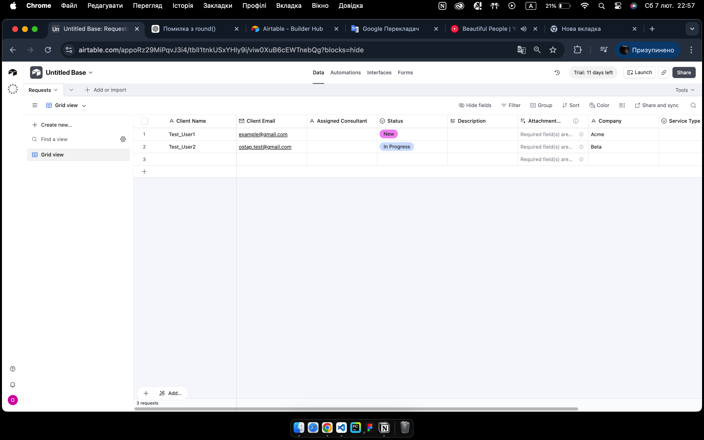
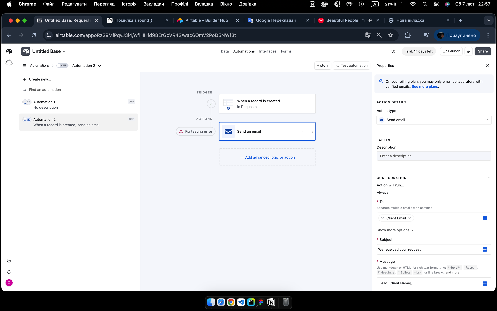

# TechFlow Consulting Task

## Link (https://airtable.com/invite/l?inviteId=invptRm2PhYQDjgFq&inviteToken=5fef84bca56dcd7e28a72aa31f25b83d568b80a8d3ed08b7afc6211fb83efd25&utm_medium=email&utm_source=product_team&utm_content=transactional-alerts)

## 📄 Опис завдання
Мета: Автоматизувати обробку клієнтських запитів для компанії "TechFlow Consulting"  
Завдання включає:
- Airtable база для зберігання запитів та консультантів
- Автоматизація розподілу запитів і нагадувань
- Python скрипт для генерації щотижневих звітів

---

## 🗂 Структура бази Airtable
**Таблиці:**
1. **Requests** – зберігає всі клієнтські запити
   - Поля: Name, Email, Company, Service Type, Request Description, Created At, Closed At, Status, Assigned Consultant
2. **Consultants** – зберігає інформацію про консультантів
   - Поля: Name, Email, Assigned Requests

**Відносини:**
- Кожен запит (`Requests`) прив’язаний до консультанта (`Consultants`) через поле Assigned Consultant

**Скріншоти:**



---

## ⚙ Автоматизації
1. **Тригер:** Новий запит в Airtable
2. **Дії:**
   - Надсилає email підтвердження клієнту
   - Автоматично призначає консультанта
   - Якщо запит не взято у роботу протягом 24 годин — нагадування менеджеру
   - Додаткові дії (опціонально)  

**Скріншот автоматизації:**


---

## 🐍 Python скрипт
Скрипт `weekly_report.py` робить:
- Отримує дані з Airtable через API
- Генерує щотижневий звіт:
  - Кількість нових запитів за тиждень
  - Кількість закритих запитів
  - Середній час обробки запиту (години)
  - Топ-3 консультанти за кількістю закритих запитів
- Зберігає звіт у CSV (`report_samples/weekly_report.csv`)

**Приклад запуску:**
```bash
python python/weekly_report.py
